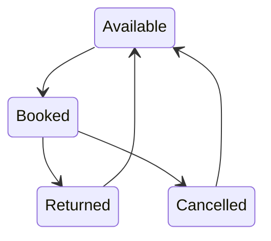

# 🌐 Vehicle Rental System API Reference


← [Back to Main Documentation](README.md)

Complete, modern, and GitHub‑ready API documentation for the **Vehicle Rental
System**.

---

## 📌 API Overview

| Item     | Details             |
| -------- | ------------------- |
| Base URL | `/api/v1`           |
| Format   | JSON                |
| Auth     | JWT Bearer Token    |
| Roles    | `admin`, `customer` |

---

## 🔐 Authentication Endpoints

### 1️⃣ User Registration

**Access:** Public **Description:** Register a new user account

```http
POST /api/v1/auth/signup
```

**Request Body**

```json
{
  "name": "John Doe",
  "email": "john.doe@example.com",
  "password": "securePassword123",
  "phone": "01712345678",
  "role": "customer"
}
```

**Success Response (201)**

```json
{
  "success": true,
  "message": "User registered successfully",
  "data": {
    "id": 1,
    "name": "John Doe",
    "email": "john.doe@example.com",
    "phone": "01712345678",
    "role": "customer"
  }
}
```

---

### 2️⃣ User Login

**Access:** Public **Description:** Authenticate user and return JWT token

```http
POST /api/v1/auth/signin
```

**Request Body**

```json
{
  "email": "john.doe@example.com",
  "password": "securePassword123"
}
```

**Success Response (200)**

```json
{
  "success": true,
  "message": "Login successful",
  "data": {
    "token": "<jwt_token>",
    "user": {
      "id": 1,
      "name": "John Doe",
      "email": "john.doe@example.com",
      "role": "customer"
    }
  }
}
```

---

## 🚗 Vehicle Endpoints

### 3️⃣ Create Vehicle

**Access:** Admin **Auth Required:** Yes

```http
POST /api/v1/vehicles
```

```http
Authorization: Bearer <jwt_token>
```

```json
{
  "vehicle_name": "Toyota Camry 2024",
  "type": "car",
  "registration_number": "ABC-1234",
  "daily_rent_price": 50,
  "availability_status": "available"
}
```

---

### 4️⃣ Get All Vehicles

**Access:** Public

```http
GET /api/v1/vehicles
```

---

### 5️⃣ Get Vehicle by ID

**Access:** Public

```http
GET /api/v1/vehicles/:vehicleId
```

---

### 6️⃣ Update Vehicle

**Access:** Admin

```http
PUT /api/v1/vehicles/:vehicleId
```

---

### 7️⃣ Delete Vehicle

**Access:** Admin

```http
DELETE /api/v1/vehicles/:vehicleId
```

---

## 👥 User Endpoints

### 8️⃣ Get All Users

**Access:** Admin

```http
GET /api/v1/users
```

---

### 9️⃣ Update User

**Access:** Admin / Own Profile

```http
PUT /api/v1/users/:userId
```

---

### 🔟 Delete User

**Access:** Admin

```http
DELETE /api/v1/users/:userId
```

---

## 📅 Booking Endpoints

### 1️⃣1️⃣ Create Booking

**Access:** Customer / Admin

```http
POST /api/v1/bookings
```

---

### 1️⃣2️⃣ Get Bookings

**Access:** Role-based

```http
GET /api/v1/bookings
```

---

### 1️⃣3️⃣ Update Booking

**Access:** Role-based

```http
PUT /api/v1/bookings/:bookingId
```

---

## 🔄 Booking Lifecycle Diagram



---

## 🧾 Standard Response Format

### ✅ Success

```json
{
  "success": true,
  "message": "Operation successful",
  "data": {}
}
```

### ❌ Error

```json
{
  "success": false,
  "message": "Error description",
  "errors": "Validation or system error"
}
```

---

## 📊 HTTP Status Codes

| Code | Meaning               |
| ---- | --------------------- |
| 200  | OK                    |
| 201  | Created               |
| 400  | Bad Request           |
| 401  | Unauthorized          |
| 403  | Forbidden             |
| 404  | Not Found             |
| 500  | Internal Server Error |

---

## 🔐 Authorization Header

```http
Authorization: Bearer <jwt_token>
```

---

## 💡 Business Rules

- `total_price = daily_rent_price × number_of_days`
- Booking creates vehicle → **booked**
- Cancel / Return → **available**
- Active booking blocks delete operations

---

✅ **Production‑ready | GitHub‑friendly | Professional API Documentation**
